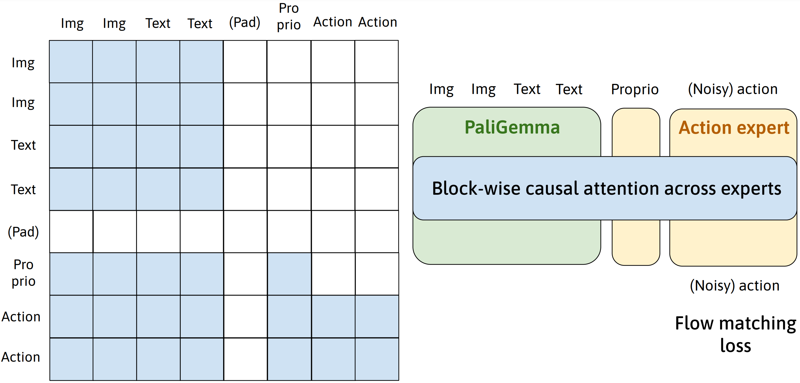

# mini-pi0


`mini-pi0` is a small, readable PyTorch implementation of the core pi0-style
vision-language-action path: PaliGemma image/text embeddings, an action expert,
block-wise attention, flow matching loss, and cached action sampling.

The goal is teaching and verification. This repo strips away RLDS/TFDS, Hydra,
DDP, LoRA, quantization, wandb, and simulator adapters so the model mechanics fit
in a few files and can be tested locally.



## Quickstart

```bash
git clone <your-mini-pi0-repo-url>
cd mini-pi0
python3.10 -m venv .venv
source .venv/bin/activate
pip install -e ".[dev]"
python examples/quickstart_tiny.py
python -m pytest tests -m "not slow and not checkpoint"
```

If you prefer conda:

```bash
conda create -n mini-pi0 python=3.10 -y
conda activate mini-pi0
pip install -e ".[dev]"
```

## What You Can Run Without Weights

- Build a tiny pi0-style model.
- Generate synthetic image/proprio/action batches.
- Compute the flow matching loss.
- Sample actions with and without KV cache.
- Run the fast pytest suite on CPU.

```bash
mini-pi0-train-synthetic \
  --model-size tiny \
  --device cpu \
  --dtype float32 \
  --num-steps 2 \
  --batch-size 2 \
  --num-samples 8 \
  --output-dir logs/tiny-smoke
```

## Optional PaliGemma Checkpoint Checks

Download the PaliGemma checkpoint into `checkpoints/`:

```bash
huggingface-cli download google/paligemma-3b-pt-224 \
  --local-dir checkpoints/paligemma-3b-pt-224
```

If HuggingFace is unreachable from your network, try:

```bash
export HF_ENDPOINT=https://hf-mirror.com
```

Then run checkpoint-dependent tests:

```bash
MINI_PI0_PALIGEMMA_CKPT=checkpoints/paligemma-3b-pt-224 \
  python -m pytest tests -m checkpoint
```

Checkpoint files are intentionally ignored by git.

## Verification Status

| Check | Default CI | Requires checkpoint | Purpose |
|---|---:|---:|---|
| Synthetic dataset contract | yes | no | Shape, range, determinism |
| Flow matching sample | yes | no | `x_t = (1-t)eps + t action`, target velocity |
| Block-wise mask | yes | no | VLM/proprio/action visibility and padding |
| Tiny model forward/sampling | yes | no | End-to-end tensor path |
| KV cache equality | yes | no | Cached vs no-cache action sampling |
| Tiny training loop | yes | no | Optimizer and checkpoint write smoke test |
| PaliGemma checkpoint load | no | yes | Strict safetensors loading |
| Full synthetic overfit | manual | yes for full mode | Local acceptance from `PROGRESS.md` |

See [docs/verification.md](docs/verification.md) for commands.

## What This Repo Is

- A minimal teaching implementation of the pi0-style VLA core.
- A place to inspect tensor shapes, attention masks, and flow matching logic.
- A lightweight testbed for comparing cached and uncached action sampling.

## What This Repo Is Not

- It is not a full robot training stack.
- It does not include RLDS/TFDS data loading, SimplerEnv evaluation, DDP, LoRA,
  quantization, or official open-pi-zero checkpoint remapping in the first
  release.
- It does not ship model weights.

## Repository Layout

```text
src/mini_pi0/
  config.py       # shape contract and model hyperparameters
  siglip.py       # SigLIP vision tower
  gemma.py        # Gemma decoder blocks and RoPE utilities
  paligemma.py    # PaliGemma wrapper and safetensors loader
  vla_modules.py  # action/proprio encoders, block mask, joint attention, KV cache
  pizero.py       # MiniPiZero loss and sampling APIs
  data.py         # synthetic dataset
  train.py        # bare synthetic training loop
tests/            # fast pytest suite plus optional checkpoint/slow tests
docs/             # architecture and verification notes
examples/         # tiny quickstart and optional PaliGemma caption demo
```

## Acknowledgements

This project is derived from and meant to explain ideas in
[open-pi-zero](https://github.com/allenzren/open-pi-zero), the pi0 paper from
Physical Intelligence, PaliGemma/Gemma/SigLIP, and related open-source reference
implementations. See the code and docs for exact verification boundaries.
